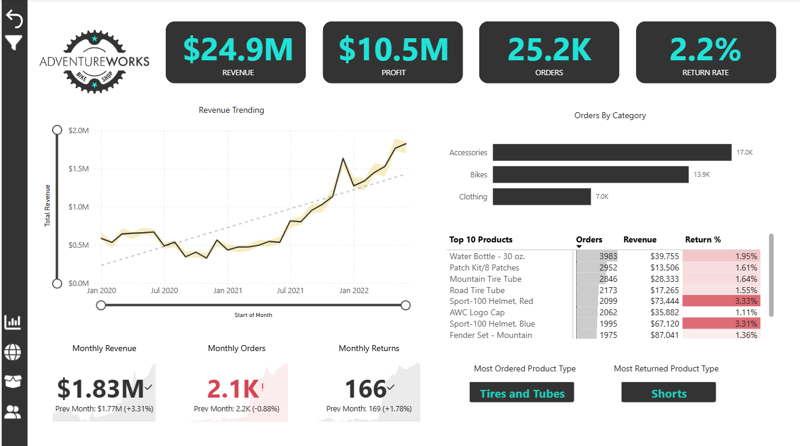
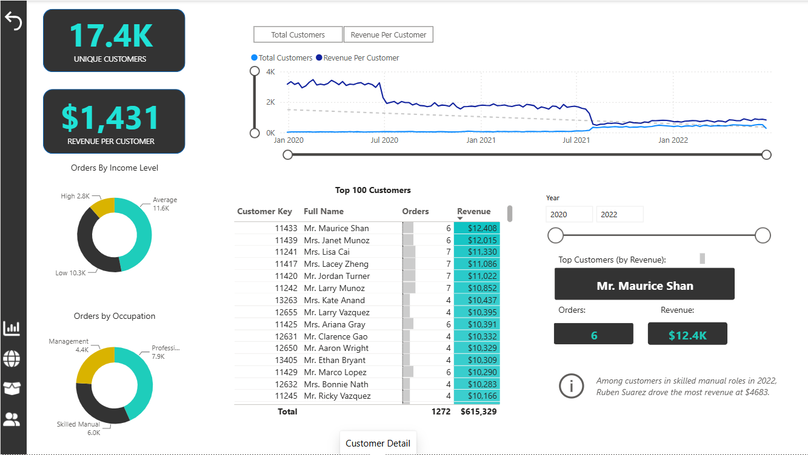
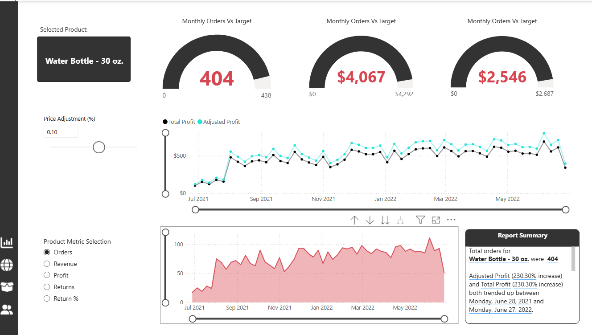
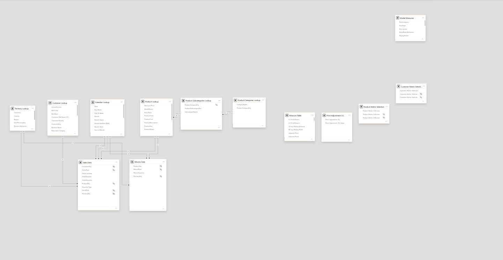

# AdventureWorks Power BI Dashboard

## 📊 Project Overview

This project is an interactive Power BI business intelligence dashboard developed using the AdventureWorks dataset as part of a Power BI Desktop for Business Intelligence course.

The project analyzes sales, revenue, profit, orders, returns, products, customers, and regional performance. The goal was to transform raw business data into an interactive reporting solution that allows users to monitor key performance indicators (KPIs), identify trends, compare product performance, analyze customer behavior, and perform What-If analysis.

The project demonstrates practical experience with Power BI, Power Query, data modeling, DAX, time intelligence, interactive dashboards, drill-through analysis, and business-focused data visualization.

---

## 🎯 Project Objectives

The dashboard was designed to answer business questions such as:

- How are revenue, profit, orders, and returns performing?
- How is business performance changing over time?
- Which product categories generate the most orders?
- Which products generate the most revenue?
- Which products have higher return rates?
- Who are the highest-value customers?
- How does customer behavior vary by income level and occupation?
- How does performance vary across geographic regions?
- How do current results compare with previous-month performance and targets?
- How would changes in product pricing affect revenue and profitability?

---

## 📈 Executive Dashboard



The Executive Dashboard provides a high-level overview of overall business performance.

### Key KPIs

| KPI | Result |
|---|---:|
| Revenue | $24.9M |
| Profit | $10.5M |
| Orders | 25.2K |
| Return Rate | 2.2% |

The page also includes:

- Revenue trend analysis
- Orders by product category
- Top-performing products
- Product return-rate analysis
- Monthly revenue performance
- Monthly order performance
- Monthly return performance
- Most ordered product type
- Most returned product type

This page is designed to give decision-makers a quick view of overall company performance.

---

## 👥 Customer Detail



The Customer Detail page focuses on customer behavior and customer-level performance.

It includes:

- Unique customer count
- Average revenue per customer
- Customer trends over time
- Orders by income level
- Orders by occupation
- Top 100 customers
- Customer order and revenue analysis
- Year-based filtering
- Top-customer identification

This page helps identify valuable customers and understand how different customer segments contribute to the business.

---

## 📦 Product Detail



The Product Detail page provides detailed product-level performance analysis.

The page includes:

- Selected-product analysis
- Monthly orders compared with target
- Revenue and profit performance
- Price adjustment What-If analysis
- Total Profit vs. Adjusted Profit
- Dynamic product metric selection
- Product performance trends
- Report summary

Users can dynamically analyze metrics including:

- Orders
- Revenue
- Profit
- Returns
- Return %

The What-If parameter allows users to evaluate how price adjustments could influence revenue and profitability.

---

## 🌎 Geographic Analysis


The geographic dashboard provides an interactive view of AdventureWorks performance across different sales territories.

Users can explore performance across regions including:

- Europe
- North America
- Pacific

The map enables geographic filtering and provides another perspective for analyzing business performance.

---

## 🗂️ Data Model



The Power BI model uses transactional sales and returns data together with multiple lookup tables.

### Main Transaction Tables

- Sales Data
- Returns Data

### Lookup Tables

- Calendar Lookup
- Customer Lookup
- Product Lookup
- Product Subcategories Lookup
- Product Categories Lookup
- Territory Lookup

The product tables create a hierarchy from products to subcategories and categories.

Additional supporting tables are used for:

- DAX measures
- Price adjustment What-If analysis
- Product metric selection
- Customer metric selection

The model allows filters from lookup tables to propagate to transactional data and supports analysis across customers, products, dates, and territories.

---

## 📁 Data Sources

The project uses AdventureWorks data stored in Excel-based source files.

The dataset includes:

- Calendar Lookup
- Customer Lookup
- Product Categories Lookup
- Product Lookup
- Product Subcategories Lookup
- Returns Data
- Sales Data 2020
- Sales Data 2021
- Sales Data 2022
- Territory Lookup

Sales information from multiple years is combined to support historical and time-based analysis.

---

## 🧮 DAX & Calculations

The project contains a dedicated measure table containing DAX calculations for business analysis.

Examples include:

### Core KPIs

- Total Revenue
- Total Cost
- Total Profit
- Total Orders
- Total Customers
- Total Returns
- Quantity Sold
- Quantity Returned
- Return Rate
- Average Revenue Per Customer

### Time Intelligence

- Previous Month Revenue
- Previous Month Orders
- Previous Month Profit
- Previous Month Returns
- YTD Revenue
- 10-Day Rolling Revenue
- 90-Day Rolling Profit

### Target Analysis

- Revenue Target
- Revenue Target Gap
- Order Target
- Order Target Gap
- Profit Target
- Profit Target Gap

### Product & Order Analysis

- Average Retail Price
- Overall Average Price
- High Ticket Orders
- Bulk Orders
- Weekend Orders
- Bike Sales
- Bike Returns
- Bike Return Rate

### What-If Analysis

- Adjusted Price
- Adjusted Revenue
- Adjusted Profit

The calculations demonstrate the use of DAX functions and concepts including:

`CALCULATE`, `SUMX`, `RELATED`, `FILTER`, `DIVIDE`, `ALL`, `DATEADD`, `DATESYTD`, `DATESINPERIOD`, `DISTINCTCOUNT`, and filter context.

For the documented DAX calculations, see:

[DAX Measures](DAX/DAX-Measures.md)

---

## 🛠️ Power BI Skills Demonstrated

This project demonstrates hands-on experience with:

- Power BI Desktop
- Power Query
- Data cleaning and transformation
- Data modeling
- Table relationships
- DAX measures
- Calculated columns
- Time intelligence
- Filter context
- What-If parameters
- KPI development
- Dynamic metric selection
- Drill-through analysis
- Conditional formatting
- Interactive slicers and filters
- Geographic visualization
- Business-focused dashboard design

---

## 💡 Key Dashboard Insights

The dashboard highlights several business observations from the analyzed AdventureWorks data:

- Overall revenue reached approximately **$24.9M**.
- Total profit was approximately **$10.5M**.
- The dataset contains approximately **25.2K orders**.
- The overall return rate was approximately **2.2%**.
- Accessories generated the highest order volume among the displayed product categories.
- Revenue accelerated notably during the later portion of the analyzed period.
- Product-level analysis shows that high order volume does not always correspond to the highest revenue.
- Return-rate analysis helps identify products that may require additional investigation.
- Customer segmentation provides insight into purchasing behavior across income levels and occupations.

---

## 📂 Repository Structure

```text
AdventureWorks-PowerBI-Project/
│
├── AdventureWorks.pbix
│
├── README.md
│
├── Data/
│   ├── AdventureWorks Calendar Lookup
│   ├── AdventureWorks Customer Lookup
│   ├── AdventureWorks Product Categories Lookup
│   ├── AdventureWorks Product Lookup
│   ├── AdventureWorks Product Subcategories Lookup
│   ├── AdventureWorks Returns Data
│   ├── AdventureWorks Sales Data 2020
│   ├── AdventureWorks Sales Data 2021
│   ├── AdventureWorks Sales Data 2022
│   └── AdventureWorks Territory Lookup
│
├── DAX/
│   └── DAX-Measures.md
│
└── Screenshots/
    ├── AdventureWorks_Exec-Dashboard.png
    ├── AdventureWorks_Customer-Detail.png
    ├── AdventureWorks_Product-Detail.png
    ├── AdventureWorks_Territory-Map.png
    └── AdventureWorks_Data-Model.png
```

---

## 🚀 How to Use This Project

1. Download or clone this repository.
2. Open `AdventureWorks.pbix` using Microsoft Power BI Desktop.
3. If Power BI requests the data source location, update the source paths to the files in the `Data` folder.
4. Refresh the dataset.
5. Use the report navigation, slicers, filters, and interactive visuals to explore the dashboard.

---

## 💻 Tools & Technologies

- Microsoft Power BI Desktop
- Power Query
- DAX (Data Analysis Expressions)
- Microsoft Excel
- Data Modeling
- Data Visualization
- Business Intelligence

---

## 📚 Project Context

This project was completed as part of a Power BI course using the AdventureWorks dataset. The objective was to apply Power BI concepts in a practical business intelligence project, including data preparation, relational data modeling, DAX calculations, interactive visualization, and business performance analysis.